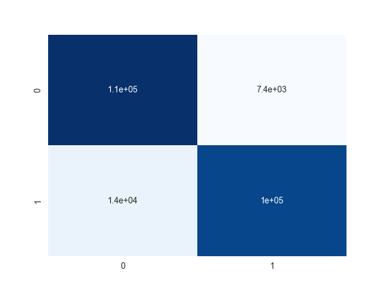

# Fine tuning DistilBert on Sentiment140 Dataset
Sentiment140 is a sentiment analysis dataset consisting of 1.6 million tweets.  800k are labeled positive, and 800k are labeled negative.

## Usage

Download the Sentiment140 dataset [here](https://www.kaggle.com/datasets/kazanova/sentiment140), and place in this directory.

Run ```data_cleaning.ipynb```, ```sent_distilbert.ipynb```, and  ```model_comparison.ipynb```.

By default the fine-tuned distilbert model will be saved in a directory called ```trained_distilbert_model``` - the saved weights can be loaded later to make predictions on similarly structured data

## Benchmarking

The fine-tuned distilbert model was benchmarked against the sentiment analysis functionality of 3 commonly used packages: nltk, textblob, and flair. 


Below is the confusion matrix for distilbert model


\
Created using python version 3.9.12
